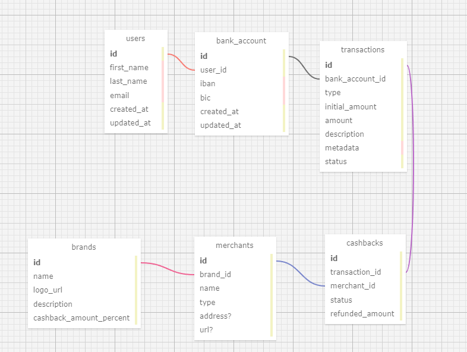

# Ki Foundation tech test

- [Ki Foundation tech test](#ki-foundation-tech-test)
  - [Run](#run)
  - [Testing requests](#testing-requests)
  - [Setup](#setup)
    - [Dependencies](#dependencies)
    - [Docker](#docker)
    - [Barebone Setup](#barebone-setup)
      - [Database](#database)
      - [Create Database Schema](#create-database-schema)
    - [Init DB](#init-db)
    - [Migrations](#migrations)
  - [Database schema](#database-schema)
  - [TODO](#todo)

## Run

```
$ yarn dev
```

(Or just run the docker-compose like indicated in the setup below if you want to use docker)

## Testing requests

Use Insomnia or Postman.
For authenticated requests (marked with the `@Authorized` decorator) we use JWT and you need to pass a JWT token with your request.
You can generate one using jwt.io or an Insomnia or Postman plugin.
The `sub` of your JWT must contain the user ID you wish to use (you can create an user in Postico or your favorite postgresql client).

## Setup

### Dependencies

```
$ yarn install
```

### Docker

Setup a development environment with Docker. Copy [.env.example](./.env.example) and rename to `.env` - `cp .env.example .env` - which sets the required environments for PostgreSQL such as `DATABASE_URL`.

Start the PostgreSQL database

```bash
docker-compose -f docker-compose-dev.yml up --build
```

### Barebone Setup

#### Database

```
$ psql -d postgres
```

```
CREATE ROLE kifoundation WITH LOGIN PASSWORD 'kifoundation';
ALTER ROLE kifoundation SUPERUSER CREATEDB;
CREATE DATABASE kifoundation_tech_test OWNER kifoundation;
GRANT ALL PRIVILEGES ON DATABASE kifoundation_tech_test TO kifoundation;
```

To make sure everything is properly set, run `\l` in `psql`. It should return something like that:

```
 Name                      | Owner            | Encoding | Collate | Ctype | Access privileges
---------------------------+------------------+----------+---------+-------+-------------------
 kifoundation              | kifoundation     | UTF8     | C       | C     | =Tc/kifoundation +
```

#### Create Database Schema

Before going any further the API expects your Postgres database to have a schema named whatever you want. Use your favorite client to connect to your postgres instance and run.
This is not needed on docker, the init script does it.

```sql
CREATE SCHEMA IF NOT EXISTS foundation;
```

### Init DB

This will drop the database and seed it, do not use in production.

```
yarn dev:db:init
```

or

```
docker-compose -f docker-compose-dev.yml exec yarn dev:db:init
```

### Migrations

Run migrations with

```
$ yarn typeorm migration:run
```

Other noteworthy commands:

```
$ yarn typeorm migration:generate src/migrations/NameOfYourMig
$ yarn typeorm migration:create src/migrations/NameOfYourMig
$ yarn typeorm migration:revert
```

## Database schema



## TODO

- Use DTO for service inputs and outputs
  - Add validation on body params using those DTOs
- Add a SessionController and allow the creation of jwt token using https://github.com/auth0/node-jsonwebtoken in exchange for a pwd
